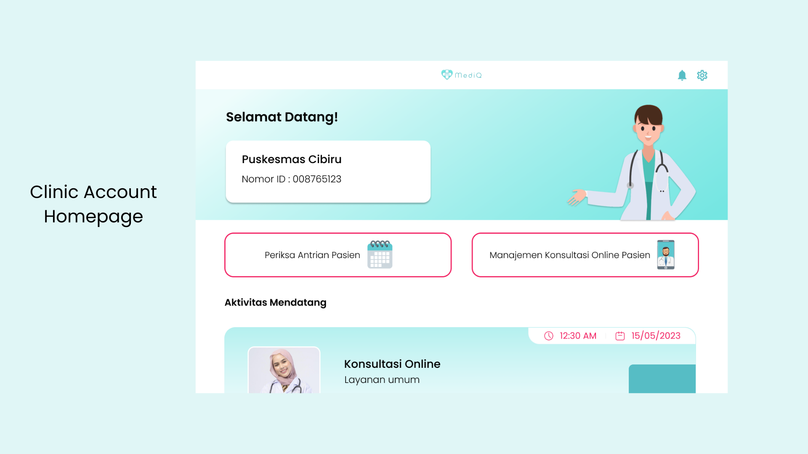

# MediQ - Beyond the Clinic Walls

  

## Introduction

In a society where medical records are unevenly distributed, uncertainty in diagnosis and treatment often arises as doctors rely solely on patient complaints during examinations. Shockingly, as of 2021, approximately 50% of Indonesia's population—around 169 million people—lack medical records, as reported by the Ministry of Health. Compounding this issue, long queues at health centers create inefficiencies in service delivery. In 2023, only about 40% of Indonesian health centers have implemented effective queuing systems, be it online or offline, posing logistical and management challenges in providing adequate services to the public. A comprehensive solution is needed to enhance efficiency and service quality in health centers.

## Meet MediQ - Your Web-Based Health Companion

MediQ is a web-based solution designed to address these challenges. Our primary features include:

- **Online and Offline Queue Booking**: Seamlessly integrated systems for both online and offline queuing, reducing wait times and improving efficiency.

- **Integrated Medical Records**: Ensure the integrity of patient records, facilitating better diagnosis and treatment.

- **Health Center Management**: Streamline health center operations, including patient and financial management.

- **Health Information Hub**: Empower users with general health information to enhance health literacy.

- **Integrated Online Doctor Consultation**: Connect with healthcare professionals and access medication distribution services at the nearest health center.

## Technologies Used

### Frontend
- **React JS**: A powerful JavaScript library for building user interfaces.
- **Tailwind CSS**: A utility-first CSS framework for creating stylish and responsive designs.

### Backend
- **Express JS**: A fast, unopinionated, minimalist web framework for Node.js.
- **Firebase**: A comprehensive platform for building and managing web and mobile applications.

## How Does MediQ Make a Difference?

By leveraging information technology in healthcare services, MediQ aims to:

- Improve accessibility, efficiency, and quality of healthcare services at the grassroots level.
- Positively impact overall community well-being.
- Assist healthcare professionals and users in monitoring health development.
- Contribute to achieving the Sustainable Development Goal (SDG) of "Good Health and Well-being," especially the target of "Universal Health Coverage."

## How To Use
1. **Install Dependencies**:
   - Run `npm install` in the project root directory to install the necessary dependencies.

2. **Start Backend**:
   - Run `npm run dev` to start the backend server.

3. **Start Frontend**:
   - Run `npm run start` to start the frontend application.

## Product Screenshot

1. **Welcome Page and Signup Page**

  

 

2. **Patient Account Homepage**

  

3. **Online Video Consultation**
   

  

  

4. **Online Queue Booking**

  

   
5. **Integrated Medical Record**

  

 

6. **Clinic Account Homepage**

  

 

7. **Check Patient Queues**

  

 
   
8. **Management Online Consultation**

  

 

## MEET OUR TEAM
1. Shabrina Maharani as Hustler
2. Auralea Alvinia Syaikha as Hipster
3. Muhammad Davis Adhipramana as Hacker
4. Rizqika Mulia Pratama as Hacker

   
